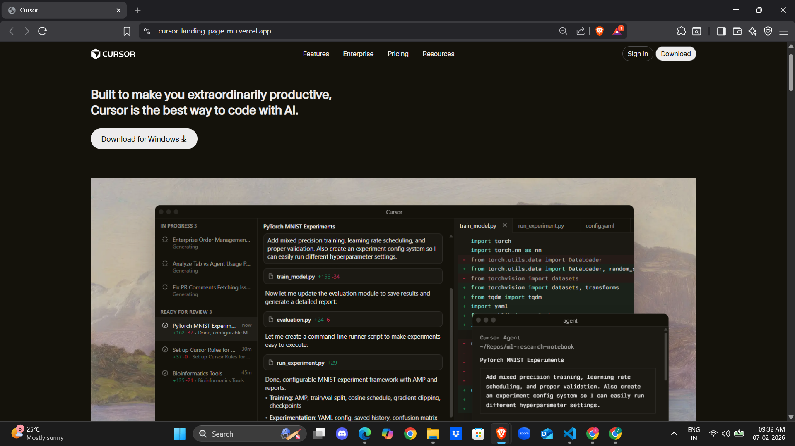
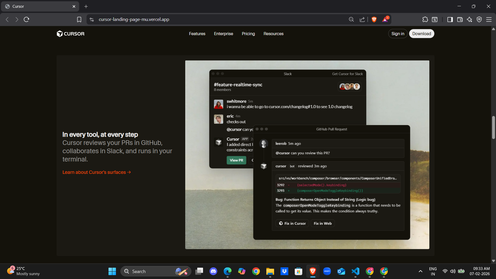
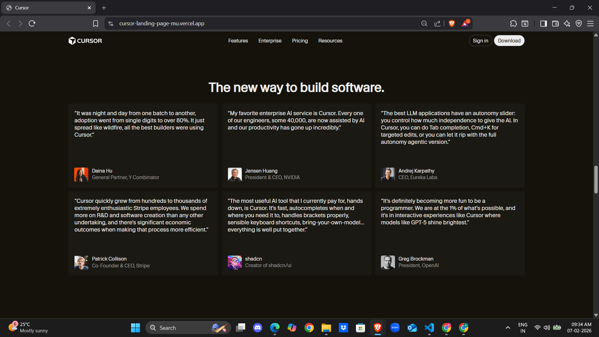

# Dev Tool Landing Page – Cursor Clone

This project is a desktop-first landing page clone inspired by the official Cursor website.  
It was built as part of the assignment, with a focus on **visual accuracy, layout structure, typography, and spacing**, rather than creativity or interactivity.

---

## 🔗 Live Demo

- **Hosted URL (Vercel):**  
  https://cursor-landing-page-mu.vercel.app/

- **GitHub Repository:**  
  https://github.com/ashaafkhan/Dev-Tool-Landing-Page---Cursor

---

## 📌 Sections Recreated

The following sections were recreated to closely match the original Cursor landing page:

1. **Top Navigation Bar**
   - Logo
   - Navigation links
   - Primary CTAs (Sign in / Download)

2. **Hero Section**
   - Main headline
   - Supporting description
   - Primary CTA
   - Product screenshot

3. **Trusted By / Company Logos**
   - Grid of well-known company logos

4. **Feature Sections (3 blocks)**
   - Two-column layout
   - Alternating text and image alignment

5. **Testimonials**
   - Quote cards
   - Name and role of users

6. **Use Cases / Feature Cards**
   - Informational cards with images and text

7. **Changelog / Updates**
   - Versioned update list with dates

8. **Team / About Section**
   - Description of the Cursor team
   - Call-to-action

9. **Recent Highlights**
   - Blog / update cards with metadata

10. **Final Call-to-Action**
    - Download prompt

11. **Footer**
    - Multi-column links
    - Company information
    - Theme icons and language selector (visual only)

---

## 🎨 Fonts & Colors Used

### Fonts
- **CursorGothic (local font)**  
  Loaded using `@font-face` from local assets  
- Fallbacks: `system-ui`, `sans-serif`

### Color Palette
| Purpose | Color |
|------|------|
| Background | `#14120B` |
| Primary Text | `#EDECEC` |
| Secondary Text | `#999896` |
| Accent / Links | `#F54A07` |

All colors are managed using CSS variables for consistency.

---

## 🛠 Tech Stack & Constraints

- **HTML5**
- **CSS3**
- ❌ No JavaScript
- ❌ No Tailwind / Bootstrap
- ❌ No animations

---

## 🖼 Screenshots

